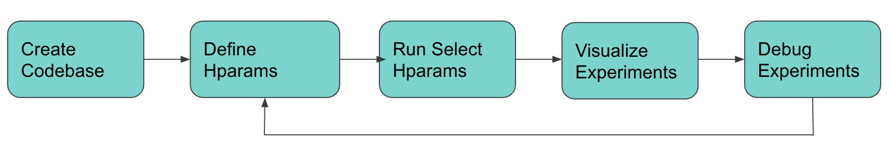
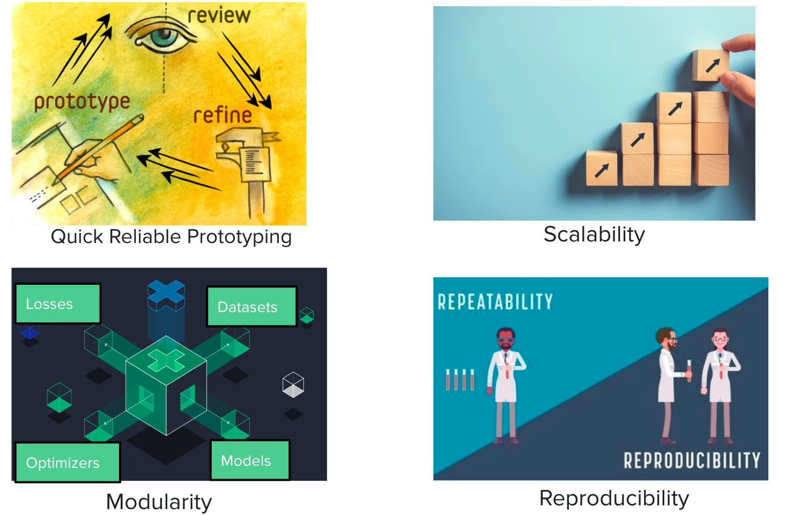

# Build End-to-End Machine Learning Projects and Manage Large-Scale Experiments

## Introduction

I will present a step-by-step demo for a generic machine learning pipeline with best practices along the way. 

The goal is to summarize these 5 main stages of building machine learning algorithms.

<p align="center" width="100%">

</p>


I am Issam Laradji, a Research Scientist at ServiceNow, currently working on tasks related to natural language processing, computer vision and optimization.


## Who is this for?

Anyone who would like to quickly and efficiently get papers published, products deployed, and competitions won.


## How can this help?

You can use this codebase as a starting point for your own machine learning project for prototyping and running large scale experiments while ensuring these features.

<p align="center" width="100%">

</p>

## Steps to run this code
### 1. Train & Validate

Run the following command

```python
python trainval.py -e baselines -sb ./results -r 1
```

Argument Descriptions:
```
-e  [Experiment group to run like `baselines`] 
-sb [Directory where the experiments are saved]
-r  [Flag for whether to reset the experiments]
```

### 2. Visualize Results

Open `results/results.ipynb` and visualize the results as follows

<p align="center" width="100%">

</p>


### Contact me

If you would like to chat or collaborate, you can reach me at [twitter](https://twitter.com/ILaradji) or [LinkedIn](https://www.linkedin.com/in/issam-laradji-67ba1a99/).
